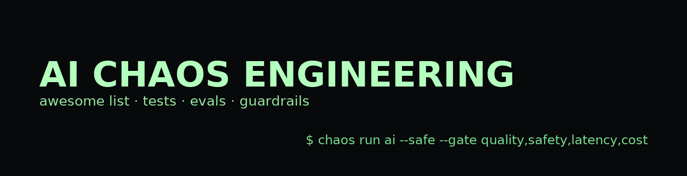

# Awesome AI Chaos Engineering 

> Curated resources for **breaking AI systems on purpose** to build resilience — evaluation, chaos experiments, guardrails, observability, governance, and case studies.

A focused, living list for teams shipping LLM/RAG/agent systems who want to **trust their AI in production**.

## Why now (short & spicy)
If you’re shipping AI, this is **not optional**. LLM/RAG/agent stacks are *stochastic, tightly coupled, and always changing*. That means:
- **Unknown unknowns** show up only under real-world messiness (weird prompts, tool glitches, stale indexes, concurrency spikes).
- **Change is constant**: model/version swaps, prompt edits, embedding/index drift—daily.
- **New SLOs** beyond uptime: answer **quality**, **safety** (toxicity/leakage/refusal), **latency** at p95/p99, and **unit cost**.
- **Governance wants receipts**: expect eval results, red-team artifacts, and mitigations.
Bottom line: *break it on purpose* so you can **trust it in production**.

---

## Contents
- [Evaluation & Metrics](#evaluation--metrics)
- [AI Chaos Experiments & Tooling](#ai-chaos-experiments--tooling)
- [Guardrails & Red Teaming](#guardrails--red-teaming)
- [Observability & Validation](#observability--validation)
- [Governance & Standards](#governance--standards)
- [Case Studies & Talks](#case-studies--talks)
- [Foundations (Chaos Engineering)](#foundations-chaos-engineering)
- [How to run AI chaos safely](#how-to-run-ai-chaos-safely-non-negotiable)
- [Contributing](#contributing)
- [Maintainers](#maintainers)
- [License](#license)

---

## Evaluation & Metrics
- **OpenAI Evals** — Framework for automated LLM evals. <https://github.com/openai/evals>
- **LM Evaluation Harness (EleutherAI)** — Research-grade benchmark harness. <https://github.com/EleutherAI/lm-evaluation-harness>
- **LangSmith Evaluation** — Concepts + how-tos for LLM evals and datasets. <https://docs.smith.langchain.com/evaluation/concepts>
- **Ragas** — RAG metrics: faithfulness, answer relevancy, context precision/recall. <https://docs.ragas.io/>
- **Promptfoo** — CLI/CI to test prompts, agents, RAG; automated red teaming. <https://github.com/promptfoo/promptfoo>
- **TruLens** — Instrumentation + evals for LLM apps; OTEL-friendly. <https://github.com/truera/trulens>
- **DeepEval** — “Pytest for LLM apps” with built-in metrics. <https://github.com/confident-ai/deepeval>
- **Phoenix (Arize)** — OSS observability + evaluation for LLM apps. <https://github.com/Arize-ai/phoenix>

## AI Chaos Experiments & Tooling
- **Integrating Chaos Engineering with AI/ML** — Using AI to predict failures from chaos runs. (Harness) <https://www.harness.io/blog/integrating-chaos-engineering-with-ai-ml-proactive-failure-prediction>
- **Chaos Engineering in AI: Breaking AI to Make It Stronger** — Failure scenarios & simulations. (Srinivasa Rao Bittla) <https://bittla.medium.com/chaos-engineering-in-ai-breaking-ai-to-make-it-stronger-3d87e5f0da73>
- **Chaos Engineering in the Age of AI** — Hidden complexity in AI systems. (Adrian Hornsby) <https://adhorn.medium.com/chaos-engineering-in-the-age-of-ai-surfacing-hidden-complexity-074efc8fa494>
- **ChaosEater (arXiv 2025)** — Automating the CE cycle with LLMs. <https://arxiv.org/abs/2501.11107>
- **AWS Fault Injection Service** — Native fault injection at the cloud layer. <https://aws.amazon.com/fis/>
- **Azure Chaos Studio** — Managed chaos for Azure workloads. <https://azure.microsoft.com/products/chaos-studio>
- **LitmusChaos** — CNCF OSS chaos platform (Kubernetes). <https://litmuschaos.io/>
- **Chaos Mesh** — OSS chaos platform (Kubernetes CRDs). <https://chaos-mesh.org/docs/>

> **Experiment ideas (AI-specific)**: context-window squeeze; tool/API timeouts + schema drift; RAG decoys/poisoning; jailbreak gauntlet; model/version swaps; concurrency spikes; token-budget exhaustion; partial outages; rate-limit flaps.

## Guardrails & Red Teaming
- **OWASP Top 10 for LLM Applications (2025)** — Risks & mitigations. <https://genai.owasp.org/llm-top-10/>
- **MITRE ATLAS** — Adversarial tactics/techniques for AI systems. <https://atlas.mitre.org/>
- **NeMo Guardrails (NVIDIA)** — Programmable guardrails for LLM apps. <https://github.com/NVIDIA/NeMo-Guardrails>
- **Llama Guard (Meta)** — Safety classifiers (multimodal v4 available). <https://huggingface.co/meta-llama/Llama-Guard-4-12B>
- **garak (NVIDIA)** — LLM vulnerability scanner / red-teaming kit. <https://github.com/NVIDIA/garak>
- **Lakera PINT benchmark** — Prompt-injection test benchmark. <https://github.com/lakeraai/pint-benchmark>
- **Microsoft: Red teaming 100 GenAI products** — Lessons + case study. <https://www.microsoft.com/en-us/security/blog/2025/01/13/3-takeaways-from-red-teaming-100-generative-ai-products/>

## Observability & Validation
- **Phoenix (Arize)** — Tracing, evals, dataset mgmt. <https://github.com/Arize-ai/phoenix>
- **OpenTelemetry** — Standard traces/metrics/logs (instrument your whole chain). <https://opentelemetry.io/>
- **Datadog + Ragas** — Evaluate prod RAG with Ragas metrics. <https://docs.datadoghq.com/llm_observability/evaluations/ragas_evaluations/>
- **LangSmith** — Tracing + evals for LLM apps. <https://docs.smith.langchain.com/evaluation>

## Governance & Standards
- **NIST AI RMF 1.0** — Risk management framework for trustworthy AI. <https://nvlpubs.nist.gov/nistpubs/ai/nist.ai.100-1.pdf>
- **NIST Generative AI Profile (AI 600-1)** — Companion profile for GenAI. <https://nvlpubs.nist.gov/nistpubs/ai/NIST.AI.600-1.pdf>
- **EU AI Act (official)** — First comprehensive AI law; timelines & obligations. <https://digital-strategy.ec.europa.eu/en/policies/regulatory-framework-ai>
- **AI Act tracker/summary** — Implementation updates & high-level overview. <https://artificialintelligenceact.eu/high-level-summary/>

## Case Studies & Talks
- **Booz Allen: Ensuring Resilience in AI** — Why CE matters for LLM apps. <https://www.boozallen.com/insights/ai-research/ensuring-resilience-in-ai.html>
- **Gremlin Reliability Intelligence (discussion)** — AI + chaos to guide experiments. <https://tfir.io/breaking-systems-to-build-better-ones-how-ai-is-reshaping-chaos-engineering/>
- **Adrian Hornsby (interview)** — Prevention paradox in chaos practice. <https://steadybit.com/talks-and-chats/experiments-in-chaos-with-benjamin-wilms-episode-1-adrian-hornsby/>
- **BMW Group’s Chaos Journey (AWS)** — Programmatic CE in the enterprise. <https://aws.amazon.com/blogs/industries/engineering-resilient-systems-bmw-groups-chaos-engineering-journey-and-insights/>

## Foundations (Chaos Engineering)
- **Netflix — Simian Army/Chaos Monkey (origin)**. <https://techblog.netflix.com/2011/07/netflix-simian-army.html>
- **Principles of Chaos Engineering** — The canonical definition. <https://principlesofchaos.org/>
- **Gremlin: History, principles, practice** — Good primer. <https://www.gremlin.com/community/tutorials/chaos-engineering-the-history-principles-and-practice/>
- **Awesome Chaos Engineering** — The original systems-focused awesome list. <https://github.com/dastergon/awesome-chaos-engineering>

---

### How to run AI chaos safely (non-negotiable)
1. **Limit blast radius** — start in prod-like staging; in prod, use canaries/flags/targeting.  
2. **Predefine stop conditions** — hard abort rules (e.g., safety score < threshold, error rate > baseline + X%); auto-rollback.  
3. **Protect data** — avoid real PII in prompts/logs; redaction/DLP; rotate secrets; scrub payloads in traces.  
4. **Don’t harm users** — prefer shadow traffic or internal accounts for adversarial tests; gate risky outputs behind policy checks.  
5. **Instrument everything** — model/retriever/tool trace IDs; collect **quality/safety/latency/cost** SLOs; store artifacts for audit.  
6. **Change management** — scheduled windows, on-call notified; rollback + comms plan.  
7. **Reproduce & compare** — record model/prompt versions, embeddings, datasets, seeds; keep control vs chaos runs.  
8. **Peer review** — PR + checklist before running; postmortems after.

---

## Contributing
Have a high-signal resource? PRs welcome! Please read [CONTRIBUTING.md](CONTRIBUTING.md) for entry format and acceptance criteria.

## Maintainers
- **@YOUR-USER** — founder/maintainer (seeking co-maintainers). Opinions welcome; PRs welcome.

**New here?** Try a starter task: [good first issues](https://github.com/YOUR-USER/ai-chaos-awesome/labels/good%20first%20issue).

## License
This list is released under **CC0-1.0** — see [LICENSE](LICENSE).

---

  
  

