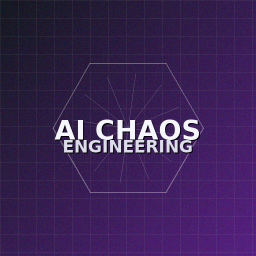

# Awesome AI Chaos Engineering 

> Curated resources for **breaking AI systems on purpose** to build resilience — evaluation, chaos experiments, guardrails, observability, and case studies.

A focused, living list for teams shipping LLM/RAG/agent systems who want to **trust their AI in production**.

---

## Contents
- [Evaluation & Metrics](#evaluation--metrics)
- [AI Chaos Experiments & Tooling](#ai-chaos-experiments--tooling)
- [Guardrails & Red Teaming](#guardrails--red-teaming)
- [Observability & Validation](#observability--validation)
- [Governance & Standards](#governance--standards)
- [Foundations (Chaos Engineering)](#foundations-chaos-engineering)
- [Contributing](#contributing)
- [License](#license)

---

## Evaluation & Metrics
- [OpenAI Evals](https://github.com/openai/evals) — Framework for automated evals; examples and docs.
- [LM Evaluation Harness](https://github.com/EleutherAI/lm-evaluation-harness) — Benchmark harness for LMs; many tasks supported.
- [LangSmith Evaluation](https://docs.smith.langchain.com/evaluation/concepts) — Concepts and tooling for LLM eval and datasets.
- [Ragas](https://docs.ragas.io/) — RAG quality metrics (faithfulness, answer relevancy, context precision/recall).
- [Arize Phoenix](https://github.com/Arize-ai/phoenix) — OSS observability and eval for LLM apps.
- [Giskard](https://github.com/Giskard-AI/giskard) — Testing, scans, and QA for ML/LLM pipelines.

## AI Chaos Experiments & Tooling
- **Fault injection / infra**: [AWS Fault Injection Service](https://aws.amazon.com/fis/), [Azure Chaos Studio](https://azure.microsoft.com/products/chaos-studio), [LitmusChaos](https://litmuschaos.io/), [Chaos Mesh](https://chaos-mesh.org/docs/).
- **Experiment ideas**: context window squeeze, tool/API timeouts and schema drift, RAG decoys/poisoning, jailbreak gauntlets, model/version swaps, concurrency spikes, token budget exhaustion.
- **Safety gates**: quality pass@k / groundedness, refusal rate & toxicity, p95/p99 latency under stress, tokens/$ per success.

## Guardrails & Red Teaming
- [Robust Intelligence](https://www.robustintelligence.com/platform/ai-validation) — Validation & firewall for AI systems.
- Curate a **prompt-injection/jailbreak suite** and measure refusal rates and leakage; document mitigations and regressions.

## Observability & Validation
- [Phoenix](https://github.com/Arize-ai/phoenix) — Tracing, dataset management, eval.
- [OpenTelemetry](https://opentelemetry.io/) — Standardized traces/metrics/logs for end-to-end chains.

## Governance & Standards
- **NIST AI RMF 1.0** — Framework for managing AI risks; emphasizes robustness & resilience.
- **EU AI Act** — Risk-based obligations; includes evaluation and adversarial testing expectations.

## Foundations (Chaos Engineering)
- [Netflix — Simian Army / Chaos Monkey](https://techblog.netflix.com/2011/07/netflix-simian-army.html) — Origin story of mainstream chaos engineering.
- [Principles of Chaos Engineering](https://principlesofchaos.org/) — Core principles and recommended practice.
- [Gremlin Guides](https://www.gremlin.com/chaos-engineering/) — Practical primers and tutorials.

---

## Contributing
Have a high-signal resource? PRs welcome! Please read [CONTRIBUTING.md](CONTRIBUTING.md) for entry format and acceptance criteria.

## License
This list is released under **CC0-1.0** — see [LICENSE](LICENSE).

---

  
  

